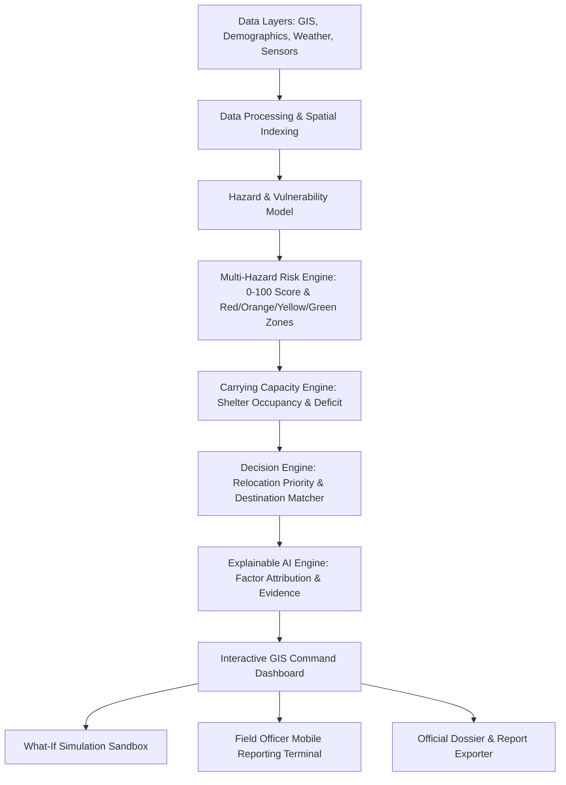

# Implementation Plan - SurakshaMap AI Platform

Build **SurakshaMap AI**, an AI + GIS-based Disaster Risk Assessment and Decision Support Platform for identifying hazard-based red zones, assessing shelter carrying capacity, and prioritizing immediate relocation needs for vulnerable habitations.

---

## User Review Required

> [!IMPORTANT]
> **Tech Stack Selection**:
> - **Frontend & GIS**: React 19 + Vite + Leaflet / React-Leaflet for interactive geospatial visualization, OpenStreetMap & satellite basemaps, custom choropleth polygons, route polylines, and pulse markers.
> - **Styling**: Modern Emergency Operations Center (EOC) design system with dark/light mode, glassmorphism, glowing risk indicators, and responsive layouts using modern Vanilla CSS tokens.
> - **Computation & Risk Engine**: High-performance TypeScript analytical engine implementing the multi-hazard risk formula ($Risk = Hazard \times Exposure \times Vulnerability$), shelter capacity deficit analysis, Dijkstra/A* evacuation route calculations, and explainable AI factor breakdowns.
> - **Data Persistence & Simulation**: In-memory GeoJSON spatial store pre-populated with realistic multi-hazard disaster scenario data (e.g., Brahmaputra / Himalayan riverine & landslide basin with 10+ habitations, 8 emergency shelters, drainage networks, hospitals, and arterial roads) plus real-time state mutation for field reports and "what-if" simulations.

---

## Architecture & System Overview

---

## Proposed Changes

The project will be built inside `c:\Users\anura\OneDrive\Desktop\Project File\Surakshamap`.

### 1. Project Initialization & Foundation

#### [NEW] [package.json](file:///c:/Users/anura/OneDrive/Desktop/Project%20File/Surakshamap/package.json)
- Setup Vite + React + Lucide Icons + Leaflet + Canvas-confetti for celebratory drills / alerts.

#### [NEW] [vite.config.js](file:///c:/Users/anura/OneDrive/Desktop/Project%20File/Surakshamap/vite.config.js)
- Configure Vite server with local port and asset bundling.

#### [NEW] [index.html](file:///c:/Users/anura/OneDrive/Desktop/Project%20File/Surakshamap/index.html)
- Main HTML entry point with Google Fonts (Outfit & JetBrains Mono for telemetry), Leaflet stylesheet, and responsive viewport.

#### [NEW] [src/index.css](file:///c:/Users/anura/OneDrive/Desktop/Project%20File/Surakshamap/src/index.css)
- Comprehensive CSS Design System:
  - Emergency Ops Center (EOC) palette: Charcoal dark backgrounds (`#0B0F17`, `#111827`), glowing status badges (Red `#EF4444`, Orange `#F97316`, Yellow `#EAB308`, Green `#10B981`, Safe Blue `#3B82F6`).
  - Glassmorphic panels with border glows, subtle grid lines, telemetry stat badges.
  - Micro-animations, alert pulse animations, route dash animations, and responsive drawer animations.

---

### 2. Core Data Models & Disaster Region GeoJSON

#### [NEW] [src/data/disasterRegionData.js](file:///c:/Users/anura/OneDrive/Desktop/Project%20File/Surakshamap/src/data/disasterRegionData.js)
- Rich pilot disaster zone dataset based on a vulnerable flood-and-landslide river basin (modelled after high-risk floodplains with hillside villages):
  - **12 Habitations**: Detailed demographics (total population, children, elderly, persons with disabilities, kachha/pucca housing ratio, hospital distance, road accessibility rating, communication score).
  - **8 Emergency Shelters**: Coordinates, max capacity, current occupancy, water reserve hours, sanitation units, medical triage availability, emergency power backup.
  - **Multi-Hazard Layers**: Flood inundation contours, landslide slip zones, river bank erosion buffers, and river water level gauging stations.
  - **Evacuation Road Network**: Primary and secondary routes between habitations and candidate shelters with road condition flags (cleared, waterlogged, blocked by debris).

---

### 3. AI & Analytical Engines

#### [NEW] [src/services/riskEngine.js](file:///c:/Users/anura/OneDrive/Desktop/Project%20File/Surakshamap/src/services/riskEngine.js)
- Implements PRD Section 11, 12, 13:
  - Multi-hazard probability calculation ($Hazard_{multi} = 1 - \prod(1 - H_i)$).
  - Vulnerability index scoring from demographic and infrastructure weights.
  - Exposure calculation (exposed population & assets).
  - Normalized Risk Score (0–100) and dynamic zoning (Green: 0–25, Yellow: 26–50, Orange: 51–75, Red: 76–100) with configurable thresholds.

#### [NEW] [src/services/capacityEngine.js](file:///c:/Users/anura/OneDrive/Desktop/Project%20File/Surakshamap/src/services/capacityEngine.js)
- Implements PRD Section 14 & 15:
  - Shelter available capacity = $MaxCapacity - CurrentOccupancy$.
  - Essential services factor (water, sanitation, food, medical readiness multiplier).
  - Habitation deficit calculation: $Deficit = \max(0, ExposedPopulation - LocalAvailableCapacity)$.
  - Habitational carrying capacity rating.

#### [NEW] [src/services/relocationEngine.js](file:///c:/Users/anura/OneDrive/Desktop/Project%20File/Surakshamap/src/services/relocationEngine.js)
- Implements PRD Section 16, 17, 18:
  - Relocation Priority Score: $Priority = Risk \times Exposure \times Vulnerability \times DeficitFactor \times AccessibilityPenalty$.
  - Categorization into Critical, High, Medium, Low.
  - Candidate Destination Matcher: Ranks shelters by travel time, available capacity, hazard buffer, and road safety.
  - Route risk evaluator (detects waterlogged/landslide road segments and switches to alternate safe routes).

#### [NEW] [src/services/explainableAi.js](file:///c:/Users/anura/OneDrive/Desktop/Project%20File/Surakshamap/src/services/explainableAi.js)
- Implements PRD Section 20 & 37:
  - Feature contribution breakdown (Water level rise contribution, road vulnerability, shelter deficit weight).
  - Human-readable narrative explanation generated for decision makers.

---

### 4. Interactive Components & Views

#### [NEW] [src/components/Header.jsx](file:///c:/Users/anura/OneDrive/Desktop/Project%20File/Surakshamap/src/components/Header.jsx)
- Application bar with real-time incident clock, threat level indicator, role switcher (District Magistrate / Disaster Officer, Field Officer, Analyst, Admin), simulation trigger button, and active alert counter.

#### [NEW] [src/components/ExecutiveKpis.jsx](file:///c:/Users/anura/OneDrive/Desktop/Project%20File/Surakshamap/src/components/ExecutiveKpis.jsx)
- Top KPI ribbon showing:
  - Monitored Habitations
  - Red Zones Count (with pulse alert)
  - Population at Risk
  - Critical Relocation Cases
  - Total Shelter Capacity vs. Deficit
  - Weather / Rainfall Gauge Summary

#### [NEW] [src/components/RiskMap.jsx](file:///c:/Users/anura/OneDrive/Desktop/Project%20File/Surakshamap/src/components/RiskMap.jsx)
- High-performance Leaflet map:
  - Layer toggles: Flood Inundation, Landslide Susceptibility, Shelters, Evacuation Routes, Critical Infrastructure (Hospitals/Schools).
  - Dynamic hazard-colored markers with animated pulses for Red Zones.
  - Interactive click handlers to highlight evacuation vectors from risk zone to candidate safe shelters.
  - Quick filter bar: By Hazard type (Flood, Landslide, River Erosion), Risk Zone (Red, Orange, Yellow, Green), Relocation Priority.

#### [NEW] [src/components/HabitationDetailDrawer.jsx](file:///c:/Users/anura/OneDrive/Desktop/Project%20File/Surakshamap/src/components/HabitationDetailDrawer.jsx)
- Deep-dive inspection side drawer (PRD Section 22):
  - Demographic & Vulnerability breakdown radar/gauges.
  - Multi-hazard risk score breakdown.
  - Shelter capacity vs. deficit gauge.
  - Recommended actions and candidate destination list with travel time and route status.
  - Explainable AI factors ("Why this priority?").
  - "Generate Official Dossier" print/export action.

#### [NEW] [src/components/WhatIfSimulator.jsx](file:///c:/Users/anura/OneDrive/Desktop/Project%20File/Surakshamap/src/components/WhatIfSimulator.jsx)
- Interactive predictive simulation modal (PRD Section 36):
  - Sliders for Rainfall Increase (+20mm to +250mm), River Surge (+0.5m to +5m), Road Inundation switch, Landslide Trigger.
  - Instant live recalculation of zone escalations (e.g. Orange -> Red), affected population surge, and shelter deficits.
  - "Run Simulation" vs "Reset to Live Feeds" actions.

#### [NEW] [src/components/FieldOfficerTerminal.jsx](file:///c:/Users/anura/OneDrive/Desktop/Project%20File/Surakshamap/src/components/FieldOfficerTerminal.jsx)
- Mobile-optimized field reporting tool (PRD Section 24):
  - GPS-tagged observation submission.
  - Hazard reporting (rising water, road blocked by fallen trees/landslide, culvert collapse).
  - Shelter occupancy live headcount update.
  - Directly feeds into central dashboard state with validation stamp.

#### [NEW] [src/components/OfficialReportModal.jsx](file:///c:/Users/anura/OneDrive/Desktop/Project%20File/Surakshamap/src/components/OfficialReportModal.jsx)
- Formatted official Habitation Risk & Evacuation Dossier (matching PRD Section 37) with print-to-PDF layout and administrative authorization sections.

#### [NEW] [src/components/AlertsPanel.jsx](file:///c:/Users/anura/OneDrive/Desktop/Project%20File/Surakshamap/src/components/AlertsPanel.jsx)
- Live feed of escalated warnings, shelter capacity overages, and blocked route alerts.

#### [NEW] [src/App.jsx](file:///c:/Users/anura/OneDrive/Desktop/Project%20File/Surakshamap/src/App.jsx)
- Main state orchestration, view management, role handling, and simulation synchronization.

---

## Verification Plan

### Automated Build & Lint Verification
- Run `npm run build` or Vite build check to ensure clean TypeScript/JavaScript compilation with zero module or syntax errors.

### Manual & Interactive GIS Verification
- Verify interactive Leaflet map rendering with all layers (Habitations, Flood Inundation, Landslides, Shelters, Evacuation Routes).
- Verify dynamic filter controls (filtering by Red zone, Hazard type, Priority).
- Test clicking any Habitation to ensure the detail inspection drawer opens with explainable AI factors, capacity deficit, and nearest safe shelters.
- Test the "What-If Disaster Simulator" to verify that increasing rainfall or river levels dynamically recomputes risk scores and escalates habitations from Orange to Red in real-time.
- Test the "Field Officer Report" submission and confirm new field reports update shelter occupancy or road blockage on the map.
- Test the "Habitation Risk Report Dossier" export modal for clean official layout.
